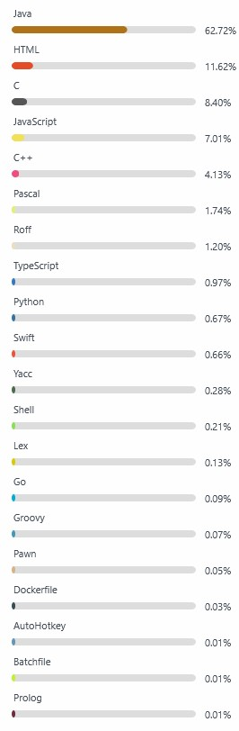

Hey there! I'm Shahar

👋

A Backend Software Engineer

<!--img src="https://github-readme-stats.vercel.app/api/top-langs/?username=shahart&langs_count=30&custom_title=Languages-Incl-Archived"-->
<!--img src="./stats.jpg"-->
<!--  -->
    Stats (a static snapshot from <a href="https://github-readme-stats.vercel.app/api?username=shahart&show_icons=true&include_all_commits=true&show=reviews&hide_rank=true">here</a>)

-  ✨ Total Stars Earned: 11 
-  🕒 Total commits: 583
-  Total PRs: 2
-  Total issues: 46

^^ That's of course just a metric from the public code.
 
Real expertise is not reflected here.

<a href="https://github-readme-stats.vercel.app/api/top-langs/?username=shahart&langs_count=30&custom_title=Languages-Incl-Archived">Languages incl Archived</a>  
<!--img src="https://github-readme-stats.vercel.app/api?username=shahart&show_icons=true&custom_title=Stats&include_all_commits=true&show=reviews&hide_rank=true"-->

<!--  -->

<!--If you got '_Something went wrong_', click [here](https://github-readme-stats.vercel.app/api?username=shahart&show_icons=true&custom_title=Stats&include_all_commits=false&show=reviews&hide_rank=true) to see the commits only from the current year.-->

 

Some static/ pointer pages:

<a href="https://shahart.github.io/puzzles-edu/">Thesis demo</a>
 
<a href="https://shahart.github.io/automations">Android App - Auto listen to radio news</a>
 
<a href="https://shahart.github.io/heb-bible/">Bible</a>
 
<a href="https://shahart.github.io/ping-me/">iWatch Ping Me</a>
 
<a href="https://shahart.github.io/ping-me/emojies.html">Emoji dictionary</a>
 
<a href="https://shahart.github.io/near-by/index.html?subject=Ramot">Near-by Chatter</a>
 
<a href="https://shahart.github.io/hebTx/">Eng > Heb 'keyboard' for Mobiles</a>
 
<a href="https://shahart.github.io/gematria-intellij-plugin/">Plugin for Gematria (IDE plugin)</a>
 
<a href="http://boostapps.com/apps/microcalc/">J2ME's Excel</a>
 
and <a href="https://www.mobyware.org/palm-os/hitori-and-nurikabe-download-113349.html">Palm Pilot game</a>
